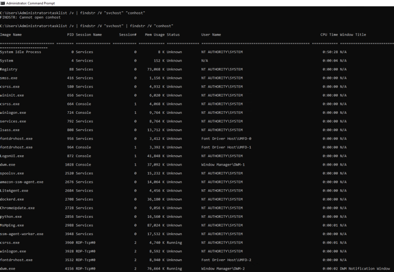
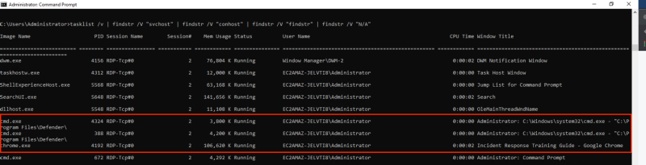
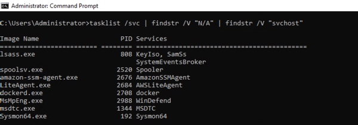
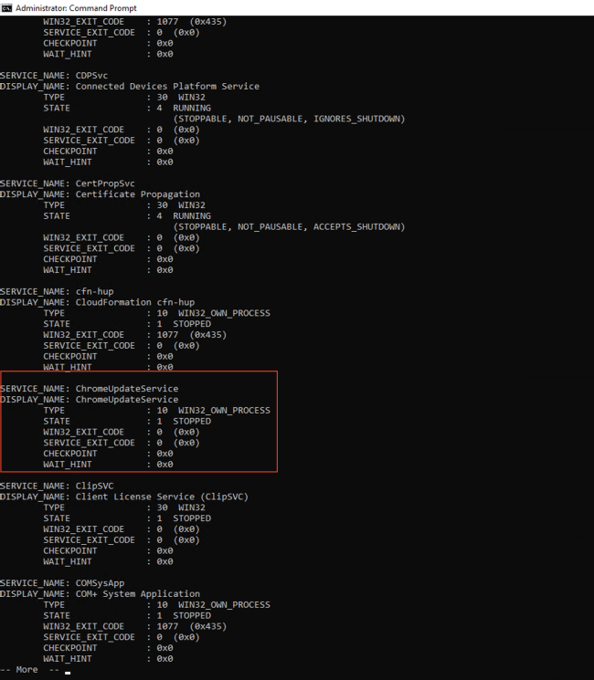
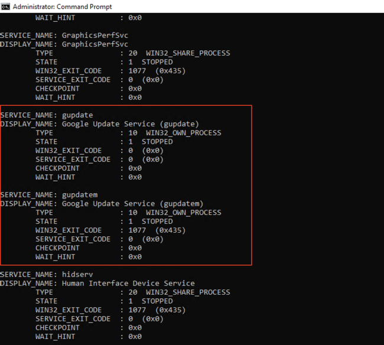
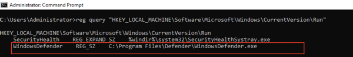
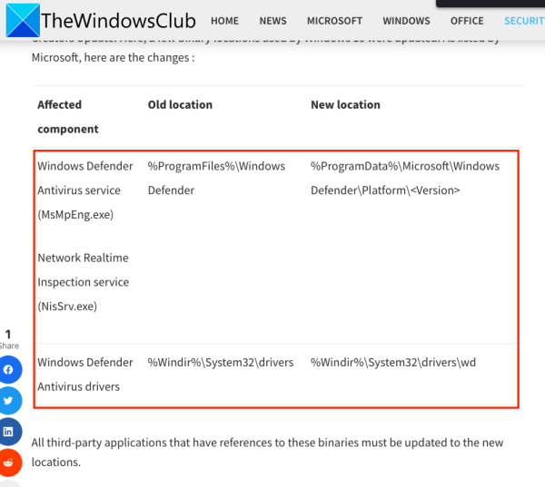

# Lab 1.1 - Host identification

- [Lab 1.1 - Host identification](#lab-11---host-identification)
  - [Introduction](#introduction)
  - [1 - Identify Network Usage](#1---identify-network-usage)
  - [2 - Identify Unusual Processes](#2---identify-unusual-processes)
  - [3 - Unusual Services](#3---unusual-services)
  - [4 - Unusual Registry Keys](#4---unusual-registry-keys)

---

## Introduction

In this lab, you are going to investigate a Windows host, which is reported to be suspicious. Before starting the lab, double click the file in `C:\Users\Administrator\Desktop\payloads\lab1.1\Lab1-Initialize.bat`

 

---

## 1 - Identify Network Usage

**Task**

- Use `netstat` to check the network usage of the host.
- Find out any unusual network usage

 

  
**Click to reveal the solution**

  This first part is a proof-of-concept, which shows you show the Windows commands in this exercise can reveal a listening port and the corresponding process. 

  You can use `netstat` for checking network usage on a Windows host.

  As a baseline, first run `cmd.exe` as admin, and then run `netstat -na`:

  

   

  Next, create a netcat listener on the host. Use the command prompt and enter the following commands:

  - `ubuntu2004`
  - `nc -lp 10000`

  

  This command will run in a Ubuntu container and create a TCP listener on tcp/10000.

   

  Then again, run `netstat -na`:

  

   

  We can also check the process ID for the executables using the TCP/UDP ports using `netstat -ano`:

  

   

  You can also run `netstat -nao 5` to make it refreshes every 5 seconds.

   

  Next, run `netstat -naob` to see the EXE and DLLs associated with each listening port.

  

   

  As you can see in this exercise, the Ubuntu container's listening port `tcp/10000` is revealed.

   

  Additionally, you will notice there are some unusual network connections:

  1. `ChromeUpdate.exe` listening on `tcp/2222`
  2. `WindowsDefender.exe` having a connection to `172.31.15.180:4444`

  At this point, you have already identified abnormal network usage on the host.

   

  You may close all of the command prompts after this.

 

---

## 2 - Identify Unusual Processes

**Task**

Use `taskmgr.exe` to identify unusual processes.

  
**Click to reveal the solution**

  On a CMD prompt, run `taskmgr.exe /v`:

  

   

  You may exclude known good result by using piping `| findstr /V "<keyword>"`.

  For example: 
  `tasklist /v | findstr /V "svchost" | findstr /V "conhost" | findstr /V "findstr" | findstr /V "N/A"`

  

   

  To check tasks associated with Windows Services, we run use:
  `tasklist /svc | findstr /V "N/A"`

    

 

---

## 3 - Unusual Services

**Task**

- Use `sc` command to find out unusual services

  
**Click to reveal the solution**

  You can obtian Windows service information by running `sc` command. The following allows you to get services and pipes the output through the `more` command to display it one page at a time:

  `sc query state= all | more`

  

  - Note the unusual service called `ChromeUpdateService`
  
   

  Confusing enough, you will see 2 Google Update services:

  

  - https://www.webnots.com/7-ways-to-disable-automatic-chrome-update-in-windows-and-mac/
  - They are legit services!

 

---

## 4 - Unusual Registry Keys

**Task**

- Identify unusual registry keys using `reg query` or `regedit`

  
**Click to reveal the solution**

  Let's look into programs automatically invoked by the host when it boots up or when a user logins. We'll look at the `Run` key.

  You may use the GUI tool `regedit` or the CLI tool `reg` to check the registry keys.

  Use the following command to query the HKLM `Run` key:

  `reg query "HKEY_LOCAL_MACHINE\Software\Microsoft\Windows\CurrentVersion\Run"`

  

  - Look like normal?
  - Think twice! Let's research Windows Defender 
  - https://www.file.net/process/windows%20defender.exe.html#:~:text=The%20Windows%20Defender.exe%20file,The%20program%20is%20not%20visible.
  - https://news.thewindowsclub.com/new-path-windows-defender-installation-windows-10-91061/

  

  - The location shown in the `Run` key is abnormal! In fact, this is one of the most used trick of malwares to pretend legit program!
  - More about Evasion on: https://attack.mitre.org/techniques/T1036/
  - More about Persistence using RunKey on: https://attack.mitre.org/techniques/T1547/001/

   

