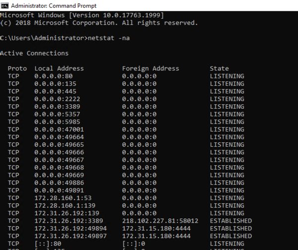

# Lab 1.1 - Host identification

- [Lab 1.1 - Host identification](#lab-11---host-identification)
  - [Introduction](#introduction)
  - [Windows commands](#windows-commands)

---

## Introduction

In this lab, you are going to investigate a Windows host, which is reported to be suspicious.

<br/>

---

## Windows commands

**Task: Check Network Usage using netstat**

<details>
  <summary>**Click to reveal the solution**</summary>
  You can use `netstat` for checking network usage on a Windows host.

  As a baseline, first run `cmd.exe` as admin, and then run `netstat -na`:

  

  <br/>

  Next, create a netcat listener on the host. Use the command prompt and enter the following commands:

  ```
  ubuntu2004
  nc -lp 10000
  ```

  

  This command will run in a Ubuntu container and create a TCP listener on tcp/10000.

  <br/>

  Then again, run `netstat -na`:

  

  <br/>

  We can also check the process ID for the executables using the TCP/UDP ports using `netstat -ano`:

  


</details>

