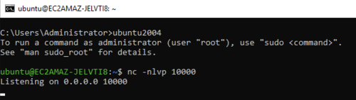
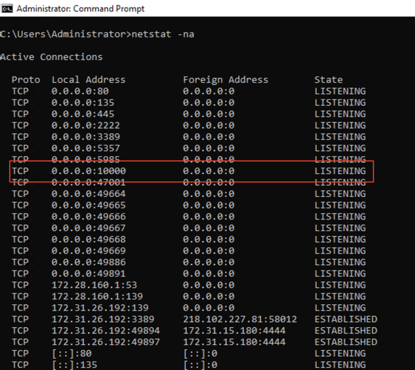

# Lab 1.1 - Host identification

- [Lab 1.1 - Host identification](#lab-11---host-identification)
  - [Introduction](#introduction)
  - [1 - Identify Network Usage](#1---identify-network-usage)

---

## Introduction

In this lab, you are going to investigate a Windows host, which is reported to be suspicious. Before starting the lab, double click the file in `C:\Users\Administrator\Desktop\payloads\lab1.1\Lab1-Initialize.bat`

 

---

## 1 - Identify Network Usage

**Task**

- Use `netstat` to check the network usage of the host.
- Find out any unusual network usage

 

  
**Click to reveal the solution**

  This first part is a proof-of-concept, which shows you show the Windows commands in this exercise can reveal a listening port and the corresponding process. 

  You can use `netstat` for checking network usage on a Windows host.

  As a baseline, first run `cmd.exe` as admin, and then run `netstat -na`:

  

   

  Next, create a netcat listener on the host. Use the command prompt and enter the following commands:

  - `ubuntu2004`
  - `nc -lp 10000`

  

  This command will run in a Ubuntu container and create a TCP listener on tcp/10000.

   

  Then again, run `netstat -na`:

  

   

  We can also check the process ID for the executables using the TCP/UDP ports using `netstat -ano`:

  

   

  You can also run `netstat -nao 5` to make it refreshes every 5 seconds.

   

  Next, run `netstat -naob` to see the EXE and DLLs associated with each listening port.

  

   

  As you can see in this exercise, the Ubuntu container's listening port `tcp/10000` is revealed.

   

  Additionally, you will notice there are some unusual network connections:

  1. `ChromeUpdate.exe` listening on `tcp/2222`
  2. `WindowsDefender.exe` having a connection to `172.31.15.180:4444`

  At this point, you have already identified abnormal network usage on the host.

   

  You may close all of the command prompts after this.

 

---