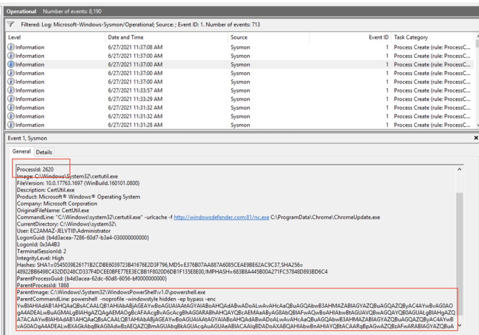

# Lab 1.2 - Containment

- [Lab 1.2 - Containment](#lab-12---containment)
  - [Introduction](#introduction)
  - [1 - Definitely NOT a containment action!](#1---definitely-not-a-containment-action)
  - [2 - Drop the connections to 172.31.15.180](#2---drop-the-connections-to-1723115180)
  - [3 - Remove the executables](#3---remove-the-executables)
  - [4 - Remove the Persistence Run key](#4---remove-the-persistence-run-key)
  - [5 - Review the artifacts](#5---review-the-artifacts)

---

## Introduction

Continue the Incident Response process. In Lab 1.1, you have identified several suspicious artifacts:

- ESTABLISHED connection to `172.31.15.180:4444`
- Listening port on `tcp/2222` from process `ChromeUpdate.exe`
- Suspicious file `C:\Program Files\Defender\WindowsDefender.exe`
- Suspicious Run key `WindowsDefender` in `HKEY_LOCAL_MACHINE\Software\Microsoft\Windows\CurrentVersion\Run`
- Suspicious service `ChromeUpdateService`

 

Now you are tasked to perform the containment process.

 

---

## 1 - Definitely NOT a containment action!

**Task**

- Connect the the host `tcp/2222`

 

  
Click to reveal the solution:

  First launch `cmd.exe` and execute:   
  - `ubuntu2004`
  - `nc 127.0.0.1 2222`

  

  - It returns a Windows command prompt
  - Backdoor reveals!
  - Perform some information gathering like `hostname`, `whoami` - SYSTEM privilege shell!

   

  Note that you shouldn't do it when during the containment! This may cause further damager to the infected host.

---

## 2 - Drop the connections to 172.31.15.180

**Task**

- Drop the connections to 172.31.15.180

 

  
Click to reveal the solution:

  Again let's find out the process IDs of the connection to `172.31.15.180`:

  - `netstat -ano | findstr "4444"`

  

  - In this case, the PIDs are `3656`, `5384` and `3896`

   

  Then, terminate the process using `taskkill`:

  - `taskkill /F /PID 3656 && taskkill /F /PID 5384 && taskkill /F /PID 3896`
  - Note the PID may be different in your case

  

   

  Then check if there is any connection to `172.31.15.180` again:

  - `netstat -ano | findstr "4444"`

  

  - Now all of the connections to `172.31.15.180` have been dropped.

---

## 3 - Remove the executables

**Task**

Remove the suspicious executables from the host.

 

  
Click to reveal the solution:

  
  There are 2 suspicious executables:
  - `ChromeUpdate.exe`
  - `C:\Program Files\Defender\WindowsDefender.exe`
  
   

  Remember we have the service name `ChromeUpdateService` and we can check the Image Path:

  - `reg query "HKLM\System\CurrentControlSet\Services\ChromeUpdateService" /v "ImagePath"`

  

  - The **ImagePath** (`binpath`) of the service is `C:\ProgramData\Chrome\ChromeUpdate.exe`

   

  Before move on the remove them, let get the file hashes of the 2 executables:

  - `powershell -c "Get-FileHash -Algorithm MD5 C:\ProgramData\Chrome\ChromeUpdate.exe" && powershell -c "Get-FileHash -Algorithm SHA256 C:\ProgramData\Chrome\ChromeUpdate.exe"`
  - `powershell -c "Get-FileHash -Algorithm MD5 ""C:\Program Files\Defender\WindowsDefender.exe""" && powershell -c "Get-FileHash -Algorithm SHA256 ""C:\Program Files\Defender\WindowsDefender.exe"""`

  

  

  - `C:\ProgramData\Chrome\ChromeUpdate.exe`
    - MD5: E0FB946C00B140693E3CF5DE258C22A1
    - SHA256: BE4211FE5C1A19FF393A2BCFA21DAD8D0A687663263A63789552BDA446D9421B
  
  - `C:\Program Files\Defender\WindowsDefender.exe`
    - MD5: 7F51F9CBF3E8CF0A304732527A8DB4FC
    - SHA256: C5BA8F1AF4DB1C4815DE5E2FBD5CC3D76D73E113F7E156CDE687F9F84F27BAB2

   

  Now try to delete the suspicious executables:

  - `del "C:\Program Files\Defender\WindowsDefender.exe"`
  - `del C:\ProgramData\Chrome\ChromeUpdate.exe`

  

  

   

---

## 4 - Remove the Persistence Run key

**Task**

- Remove the Run key used for persistence

 

  
Click to reveal the solution

  Remember we have identified the persistence key `WindowsDefender` in `HKEY_LOCAL_MACHINE\Software\Microsoft\Windows\CurrentVersion\Run`.

  Use the following command to delete the registry key:

  - `reg delete HKEY_LOCAL_MACHINE\Software\Microsoft\Windows\CurrentVersion\Run /v WindowsDefender`

  
  

 

---

## 5 - Review the artifacts

**Task**

- Review the artifacts found and ensure that all of them got removed
- Is there anything weird? Why? If yes, what is the lessons learnt here?

 

  
Click to reveal the solution

  This part this similar to lab 1. Here are the commands that you may use:

  - `netstat -ano | findstr 4444`
  - `reg query HKEY_LOCAL_MACHINE\Software\Microsoft\Windows\CurrentVersion\Run`
  - `sc query ChromeUpdateService`
  - `dir C:\Program Files\Defender\`
  - `dir C:\ProgramData\Chrome\`

  

   

  As you can notice, the removed executables come back! To see how they come back, let's dig into the event logs.

  Launch **Event Viewer** and filter EventID `11` (Sysmon - FileCreate) - you can find Sysmon logs in `Event Viewer/Applciations and Services Logs/Microsoft/Windows/Sysmon/operational`.

  

  Checking the event logs, you will find the following 2 related to the suspicious executables:

  

  

   

  Take the process ID `2620` as an example. Let's filter out EventID `1` (Sysmon - Process Create). Check each log entry and you will find the following:

  

  - The execution of `certutil` is as a result of an encoded PowerShell script.

   

  Let's find the what is **ParentProcessId** `1868`:

  

   

  Further find what is **ParentProcessId** `5136`:

  

  - The ParentProcess is `svchost.exe`, and if you look at the command line argument - `-k netsvcs -p -s Schedule`
  - Not familiar with it? Just Google!
  - https://nasbench.medium.com/a-deep-dive-into-windows-scheduled-tasks-and-the-processes-running-them-218d1eed4cce
  - This is in fact related to **scheduled task**!
  
   

  Let's open **Task Schedular** and have a look at the **Task Scheduler Library** - you will find a task called `HealthChecker`:

  

  - So that's how the suspicious keeps coming back!
  - To contain, we have a couple of things to do:

  1. Remove the Schedule Task `HealthChecker`
  2. On firewall, block the IP behind `windowsdefender.com` (Extra mile exercise - how this work??)
  3. Remove the BAT file

   

  A key takeaway of this exercise is that - it is common that we miss things in an incident. It is important to find all of the persistence method and do root cause analysis to identify how the attacker compromise in the first place. Otherwise, even after the incident, you are likely to be compromised again!

   
  

