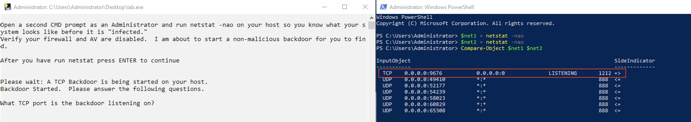
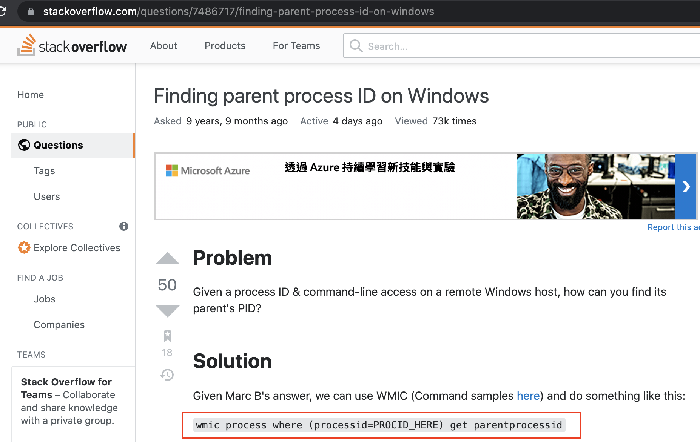
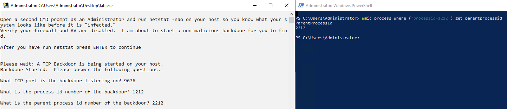
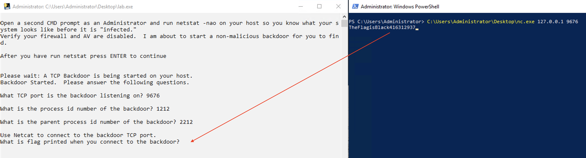
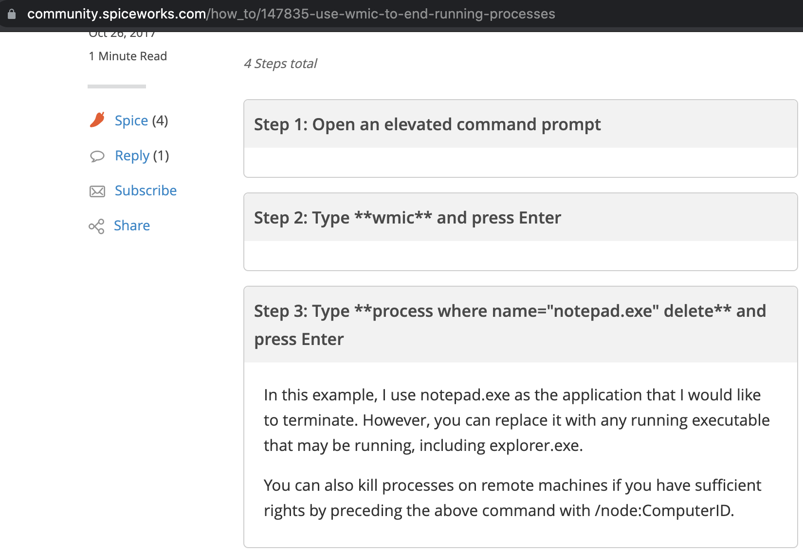

# Lab 1.3: Review Game

- [Lab 1.3: Review Game](#lab-13-review-game)
  - [Introduction](#introduction)
  - [1 - Download lab.exe](#1---download-labexe)
  - [2 - Usage](#2---usage)
  - [3 - Solution](#3---solution)

---

## Introduction

This lab is designed to show how a few simple commands can be used to identify unusual processes running on your host. 

This lab will launch non-persistent, benign processes on your host that listen on network ports and establish communications using common malware techniques. 

It will then ask you various questions about those processes. The process id number, TCP ports and other information is chosen randomly so you can run this lab multiple times for practice.

<br/>

This lab is designed by SANS and used in the SEC504 class.

Source - https://github.com/MarkBaggett/504lab

<br/>

---

## 1 - Download lab.exe

Download  `lab.exe` from `http://windowsdefender.com:81/lab.exe` using command prompt:

```
certutil -urlcache -f http://windowsdefender.com:81/lab.exe C:\Users\Administrator\Desktop\lab.exe
```

<br/>

Also download `nc.exe` which you will use in this lab:

```
certutil -urlcache -f http://windowsdefender.com:81/nc.exe C:\Users\Administrator\Desktop\nc.exe
```

<br/>

Info:
If error shows `ERROR_WINHTTP_CANNOT_CONNECT`, disable all your firewall and Windows Defender on the VM.

<br/>

---

## 2 - Usage

First, make sure your antivirus software and firewall are disabled. The tool will launch benign processes on your host that mimic the typical behavior of malware. Firewalls and antivirus products may prevent this tool from functioning properly. 

<br/>

Once a malware behavior has launched you will be asked to find and investigate it. This tool will present you with questions about the "malware" that you will need to answer to move on to the next step. If you are stuck you submit an answer of `help` and it will give you a hint. 

<br/>

Alternatively you can look at the walk-through below. To begin run this program and then open a second command prompt that is running as an Administrator. 

Use the second window to investigate the "malware" and the first window to submit your answers.

<br/>

---

## 3 - Solution

<br/>
<br/>
<br/>
<br/>
<br/>
<br/>
<br/>
<br/>
<br/>
<br/>
<br/>
<br/>
<br/>
<br/>
<br/>
<br/>
<br/>
<br/>
<br/>
<br/>
<br/>
<br/>
<br/>
<br/>
<br/>
<br/>
<br/>
<br/>
<br/>
<br/>
<br/>
<br/>
<br/>
<br/>
<br/>
<br/>
<br/>
<br/>
<br/>
<br/>
<br/>
<br/>
<br/>
<br/>
<br/>
<br/>
<br/>
<br/>
<br/>
<br/>
<br/>
<br/>
<br/>
<br/>
<br/>
<br/>
<br/>
<br/>
<br/>
<br/>
<br/>
<br/>
<br/>
<br/>
<br/>
<br/>
<br/>
<br/>
<br/>
<br/>
<br/>
<br/>
<br/>
<br/>
<br/>
<br/>
<br/>
<br/>
<br/>
<br/>
<br/>
<br/>
<br/>
<br/>

```
KNOW THY SYSTEM!

Open a second CMD prompt as an Administrator and run netstat -nao on your host so you know what your system looks like before it is "infected."
Verify your firewall and AV are disabled.  I am about to start a non-malicious backdoor for you to find.

After you have run netstat press ENTER to continue
```

<br/>

You could as the question suggests just look at `netstat`, press enter, run `netstat` a second time and then compare the results manually.

But you could also let your system do the hard part for you. 

- Open up a Powershell prompt running as administrator then record the results of `netstat -nao` into a variable called `net1`.
  - `$net1 = netstat -nao`
- Then press `enter` in the other window to let the lab start the backdoor.
- Then, back in PowerShell type `$net2 = netstat -nao` to capture the updated netstat into another variable named `net2`. 
- Then you can use PowerShell's `compare-objects` applet to show you the differences between the two results.



<br/>

With this information, you know the backdoor's **Listening Port** and **Process ID**.

<br/>

```
What is the Parent process id number of the backdoor?
```

To answer this, simply Google how to do it - search for `wmic get parent process id`:



- `wmic process where ('processid=<PID>') get parentprocessid`



- Here you will get the **Parent ProcessID** of the backdoor!

<br/>

```
Use Netcat to connect to the backdoor TCP port.
What is flag printed when you connect to the backdoor?
```

Here you will need the tool downloaded in the beginning - `nc.exe`! Connect the the listening port using the `nc.exe` downloaded:

```
C:\Users\Administrator\Desktop\nc.exe 127.0.0.1 <LISTENPORT>
```



<br/>

```
What TCP port is the backdoor listening on now?
```

- Remember the technique we used at the beginning?
- No hint here :)

<br/>

```
Now use wmic to kill the process.
Press enter after you have killed the process.
```

- Google! - Search for `wmic kill process`



- `wmic process where ('processid=<PID>') delete`

<br/>

```
This PowerShell backdoor was easy to find because it listened on a TCP port.  A more typical PowerShell backdoor will not.  Instead it makes periodic client connections to a command and control server.  Now I'm creating a new PowerShell process that does not listen on a port.

What is the process id number of the backdoor?
```

- `tasklist /svc | findstr powershell`
- `Get-Process -name powershell | Select-Object -Property id,starttime`

<br/>

```
Use wmic to retrieve the CommandLine and answer the following.

What is the flag contained in the script executed by the backdoor?
```

- Google - search for `wmic get commandline`
  - `wmic process where "name like '%powershell%'" get processid,commandline`
- When you get the Command Line, do you notice something weird?
  - What is the parameter `enc` stands for?
  - How to interpret it?
  - base__decode!

<br/>

```
Now use wmic to kill the process.
Press enter after you have killed the process.
```

- Again! Reuse the technique!

<br/>

---